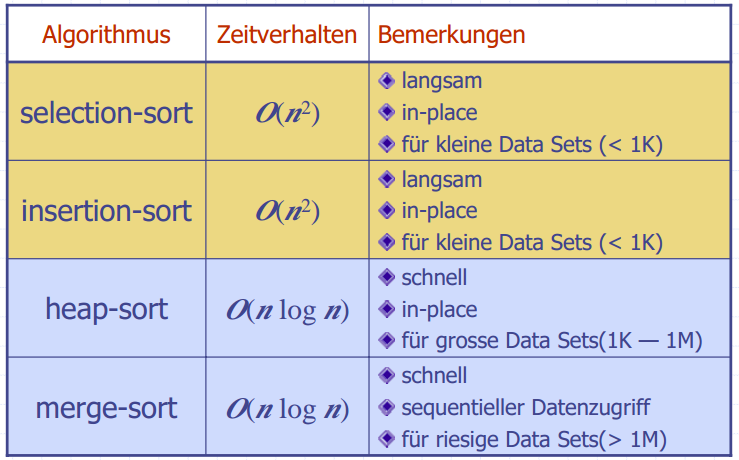
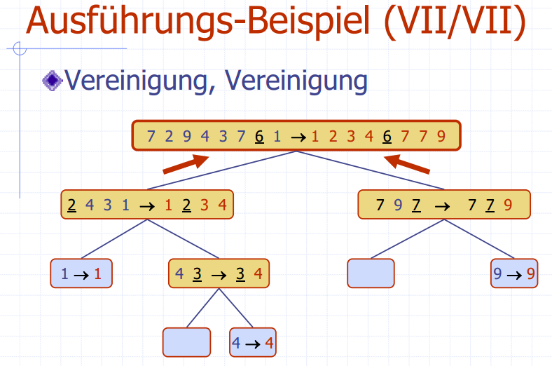
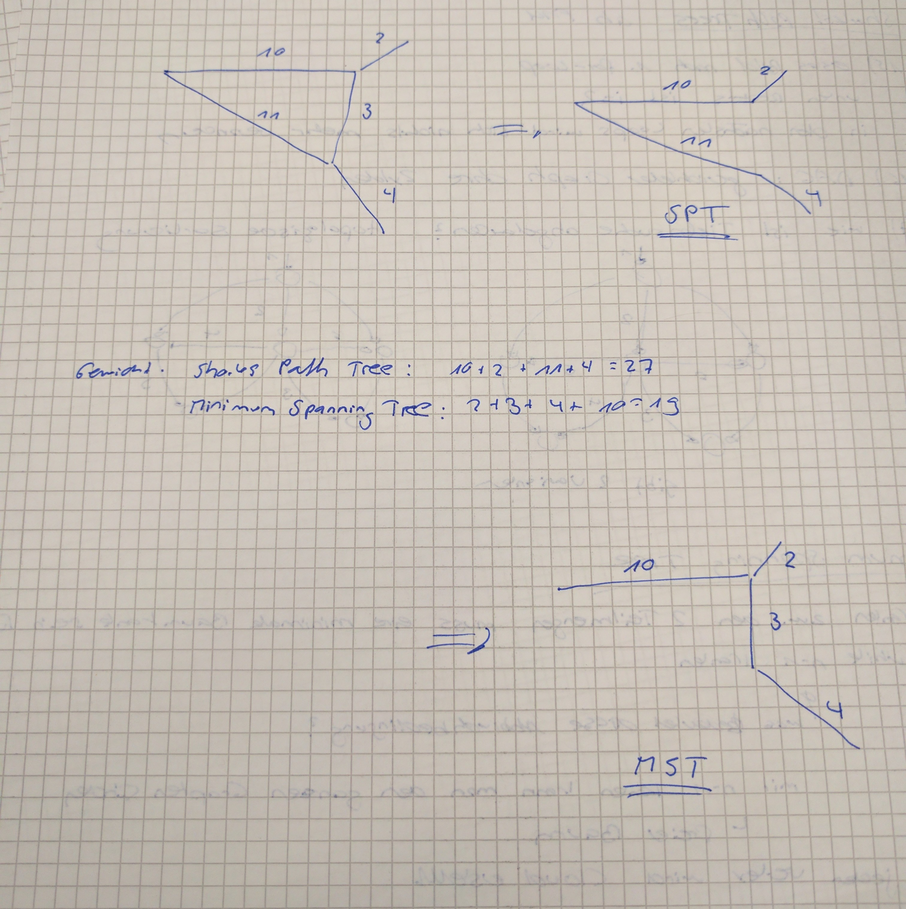

# Algorithmen und Datenstrukturen 2
- Visualisierungen: <http://visualgo.net/>

## Prüfung
- Open Book
- Vorgaben auf titelblatt
- Musterprüfung auf Skripteserver

---
## Vorlesung 1 - Binary Search Tree
- Ein Heap hat das kleinste oder grösste Element als Root
- Eine Suche auf einem Heap würde mit \(O(n)\) laufen, da man nicht weiss, welches Child jeweils kleiner / grösser ist
- Multimaps: Pro Key sind mehrere Values erlaubt

- **Folie 5**  
Voraussetzung: Random Access, Daten müssen sortiert sein

- **Folie 6** 
    - Insert: Finden der richtigen Position: \(O(log(n))\), Rest verschieben: \(O(n)\)  
    - Remove gleich wie Insert

- **Folie 7**  
    - Der Baum muss so aufgebaut sein, dass der linke Child-Knoten immer <= Parent-Node ist
    - Externe Knoten speichern keine Daten. Wenn man beim Suchen einen Blattknoten erreicht, ist der Key nicht gefunden
    - Eine Inorder Traversierung besucht die Keys in aufsteigender Reihenfolge

- **Einfügen**  
    - Suchen nach dem einzufügenden Key
    - Man wird auf einen "Sentinel" external Node treffen
    - Dort den neuen Key einfügen und in einen internen Knoten umwandeln
    - Bei einer *Multimap* kann es mehrere gleiche Keys geben. Dann:
        - find, bis man auf den Knoten trifft
        - nach links weiter suchen bis man auf einen external Node trifft
        - Dort einfügen und in internen Node umwandeln

- **Löschen**  
    - Knoten hat zwei Blatt-Kinder:
        - Lösche v und sein linkes Child, rechtes Child rutscht nach oben
    - Knoten hat ein Blatt-Kind:
        - Lösche v und den Blatt-Knoten (links oder rechts), der andere Knoten (mit einem Key) rutscht nach oben
    - Knoten hat keine Blatt-Kinder:
        - Finde den Knoten `w`, der `v` in der Inorder-Traversierung folgt ("links unten des rechten Teilbaums von `v`")
        - Kopiere den Key von `w` zu `V`
        - Lösche `w` mit dem gleichen Algorithmus wie bei Fall 1 und 2
    - *Für die ersten beiden Fälle ist der Algorithmus derselbe*

- **Performance**  
    - Worst Case: Komplett unbalancierter Baum (z.B. Einfügen mit *sortiertem* Input). Höhe ist \(O(n)\). Dann ist es eine Linked-List
    - Best Case: Mit der Mitte beginnen, komplett Balanciert.
    -  Höhe \(log(n)\)
    - Balanciert sich nicht selbst (wie andere Bäume, s. später)
- **Implementierung**
    - Hier haben die Attribute der Klasse `Knoten` die Visibility `package`, d.h es kann direkt darauf zugegriffen werden
    - Einfügen: Map (nicht Multimap). Wenn der Key schon vorhanden ist, bleibt er einfach bestehen (key wird zurück gegeben)
---
## Vorlesung 2 - AVL-Trees (1)
Bei einem AVL Tree muss für jeden Teilbaum gelten, dass die Kinder maximal einen Höhenunterschied von 1 haben.

Beweis: Jeder AVL-Baum mit minimalen Anzahl Knoten \(n\) bei Höhe \(h\) hat einen linken und rechten Teilbaum. Der eine Teilbaum hat Höhe \(h - 1\) und der rechte \(h - 2\)

$$n(h) = 1 + n(h-1) + n(h-2)$$
$$n(h) > 2n(h-2)$$
$$n(h-2) = 1 + n(h-3) + n(h-4)$$
$$n(h-2) > 2n(h-4)$$
$$n(h) > 4n(h-4)$$
$$n(h-4) = 1 + n(h-5) + n(h-6)$$
$$n(h-4) > 2n(h-6)$$
$$n(h) > 8n(h-6)$$
$$\ldots$$
$$n(h) > 16n(h-8)$$
$$n(h) > 2^i n(h-2i)$$

$$n_{min}(h=1) = 1$$
$$n_{min}(h=2) = 2$$

$$i: h-2i = (1 | 2)$$
$$h = (1 | 2) + 2i$$
$$\text{bsp.:}$$
$$i = 1 : h = 3 | 4$$
$$i = 2 : h = 5 | 6$$
$$i = 3 : h = 7 | 8$$
$$ i = \frac h2 - 1 \text{ wobei h/2 gerundet}$$
Einsetzen in \(n(h) > 2^i n(h-2i)\):
$$n > 2^{\frac h2 - 1} \cdot (1 | 2)$$
Konstanten heraus streichen:
$$n > 2^{\frac h2-1}$$
$$log(n) > \frac h2 - 1$$
$$h < 2\cdot log(n) + 2$$
$$\rightarrow h \in O(log(n))$$

- Einfügen:
    - Den neuen Knoten wie bei einem BST einfügen
    - Prüfen, ob AVL-Bedingungen verletzt wurden
    - Aus dem neuen Knoten aus solange nach oben wandern, bis man auf einen Eltern-Knoten eines unbalancierten Teilbaums trifft
- Umstrukturierung:
    - x, y, z: Aufgrund des Suchpfades Kind, Eltern, Grosseltern
    - a, b, c: Inorder-Reihenfolge
    - Wenn es von x bis z nur in eine Richtung geht: Rotation um b (= y)
    - Bei Richtungsänderung von x bis z:
        - Zuerst den Teilbaum b und c (x und y) rotieren, so dass a, b, c wieder in einer Richtung ist wie oben
        - Wieder wie oben um b rotieren
    - *(Tipp:)* Jeweils nach Rotation mit Inorder Traversierung prüfen
    - Eine Restrukturierung mit Cut/Link muss nicht den gleichen Baum ergeben wie mit dem Rotationsverfahren!
- Löschen
    - Löschen wie bei BST
    - Die Balance kann verletzt werden
    - Die Knoten x, y, z sollten im höheren Teilbaum sein (beim Einfügen automatisch gegeben)
    - Nach dem Restrukturierung kann eine neue Unbalance entstehen! (Im Gegensatz zum Einfügen). Man muss bis zur Root weiter nach Unbalancierten Teilbäumen suchen
- Implementierung
    - Mit einer AVL-Node wird dessen Höhe gespeichert
    - actionPos: Die Position, in der etwas passiert ist (z.B. letzte Einfügeposition). Ist ein Attribut der BST-Klasse
    - Nach dem Einfügen wird die (BST-)Node (Item) mit einer Instanz von AVLItem ersetzt
    - Besser: Funktion newNode() des BST überschreiben

---
## Vorlesung 4 - Splay-Trees / Merge-Sort
### Splay-Trees
- Nach dem Einfügen ist der eingefügte Knoten immer Root
- Beim Suchen wird der Baum auch restrukturiert, der gesuchte Knoten ist danach Root
- Knoten mit gleichem Wert können weit auseinander sein
- Suchen gleich wie bei BST
- Muss nicht Balanced sein wie AVL!

#### Splay-Operation
- Wird nach *jeder* Operation (auch Suchen) ausgeführt
- rechts und links Rotation gleich wie bei AV"L
- "zig" -> linkes Kind, "zag" -> rechtes Kind
- x: betroffener Knoten, y: parent von x, z: parent-parent von x
- Rotationen solange wiederholen, bis x Root wird

#### Löschen
- Wie bei BST
- Bei "Fall 3": Ersetze Knoten durch inorder-Nachfolger
- Splayen mit tiefstem internem *zugegriffenem* Knoten (Elternknoten des gelöschten)

#### Performance
- Splaying: \(O(h)\)
    - Durchschnittlich \(O(logn)\)
    - Worst case ist Höhe h = n, d.h. \(O(n)\)
- Oft besuchte Knoten kommen immer näher an die Root, d.h es wird schneller
- Anwendung z.B. bei Suchmaschinen

#### Splay-Entscheid
- Wenn mit find() nicht gefunden wird, der letzte gefunden Knoten nehmen

### Merge-Sort
- Divide and Conquer Prinzip
    - Daten in zwei Teilmengen aufteilen
    - Problem rekursiv für beide Teilmengen lösen
    - Conquer: Lösungen mischen
    - Verankerung ist Inputgrösse 1 oder 0
- Merge-Sort sortiert Rekursiv die halbe Menge und "merged" die beiden sortierten Teilmengen zusammen
- Merge()
    - Beide Listen von vorne her leeren
    - Wenn A kleiner ist, A in S einfügen, sonst B in S einfügen
    - wenn eine Liste leer, der Rest der anderen an S anfügen
    - \(O(n)\) mit double-linked-List
- Performance
    - Die Höhe des Rerkursionsbaums ist \(O(log n)\)
    - Jede Rekursion braucht \(O(n)\)
    - Total \(O(n log n)\)
- Java.util.sort ist ein modifizierter Merge-Sort
    - Wenn das grösste Element der ersten Liste kleiner als das kleinste Element der zweiten Liste ist, kann man einfach die beiden Listen aneinander hängen (keine Vergleiche nötig)
    - Garantiert \(O(n log n)\)

- Implementierung nicht-rekursiv
    - mit i = 1: Zweier-Pärchen sortieren und in out schreiben
    - in und out swappen
    - Nun Vierer-Gruppen (zwei Pärchen) sortiert in out schreiben
    - in und out swappen
    - usw... Es wird immer verdoppelt
    - Quasi im rekurvis-Baum "Bottom up"

---
## Vorlesung 5 - Quick-Sort
- Vergleich Insertion-Sort (\(O(n^2)\)) und Merge-Sort (\(O(n log n)): Bei \(2^{14}\) Elementen ist Merge-Sort 100x schneller, bei 1 Mio. Elementen ist es 6'400x schneller
- Insertion Sort würde für 1 Mio. Elemente ca. 1h 47' benötigen, merge-Sort nur einige Sekunden

### Quick-Sort
- Partitionierung in 3 Mengen: Less, Equal und Greater mit einem Pivot x
    - Jedes Element in die richtige Menge kopieren -> \(O(n)\)
- Rekursiver Aufruf mit L und G
- Zusammensetzen: L, E, G hintereinander wieder einfügen

- Wenn der Pivot immer das minimum oder maximum ist, gibt es einen einseitigen "tree", d.h Worst-Case ist \(O(n^2)\)
- Der optimale Pivot wäre der mittlere Wert
- Wenn die Daten normalverteilt sind, gibt es zu 50% "bad-calls" bei zufälliger Wahl des Pivots (1. und 4. Viertel)
- Erwartet wird ein Baum mit Höhe \(log n\). Jedes Level benötigt \(O(n)\), also total \(O(n log n)\)
- In-Place Quicksort
    - Worst-Case: Wenn die Liste bereits sortiert ist

### Sorting Lower Bound
- Jede Permutation von Daten zeigt einen Pfad durch den Entscheidungsbaum
- Das gibt n! Permutationen, also ist die Höhe des Baumes log(n!)
$$n^n > n! > {\frac n2}^{\frac n2}$$
- Die Untere Grenze für *Vergleichs*algorithmen ist \(O(n log(n))\)

### Bucket-Sort
- Eine Sequenz mit Key-Value-Paaren
- Jedes Item in ein Array mit dem Key als Index kopieren
    - Genauer ein Array von Listen, Elemente mit gleichem Key werden der Liste angehängt
- Array durch iterieren und der Reihe nach ausgeben
- Laufzeit: \(O(n + N)\), wobei N der grösstmögliche Wert der Keys ist
    - Kein Widerspruch zu oben, weil Algorithmus nicht vergleichs-basiert ist
- Eingeschränkt auf ganze, positive Zahlen
- *Stabile* Sort-Eigenschaft: die relative Ordnung von Items mit gleichem Wert wird nicht verändert

---
## Vorlesung 6 - Radix-Sort / Pattern Matching
### Lexikographische Sortierung
- Die letzte Dimension wird *zuletzt* sortiert, d.h die Dimension mit 1. Priorität am Schluss
- Einfachste Anwendung ist mit Strings
- Radix-Sort
    - Lexikographische Sortierung mit Bucket-Sort

### Pattern Matching
- Ziel: In einer Sequenz von Zeichen ein Pattern finden
- Substring wird hier inklusive end-index angegeben. In Java geht der Substring bis endIndex - 1!
- Brute-Force-Methode
    - Pattern am Anfang des Textes ansetzen und Zeichen für Zeichen durchlaufen bis zum Ende
    - Bei jeder Iteration prüfen, ob das Pattern übereinstimmt
    - Performance: Pattern m n Mal durchsuchen -> \(O(n\cdot m)\)
- Boyer-Moore Heuristik
    - "Looking Glass": Starte jeweils am Ende des Patterns
    - "Character Jump": Bei einem Mismatch wird mit dem Pattern an die nächstmögliche Position gesprungen, wo das Zeichen im Text im Pattern vorkommt (wenn nicht, kann es gleich weiter geschoben werden um ganze Patternlänge)
        - Es muss zwinged auf das letzt auftretende (möglichst weit rechte) Zeichen ausgerichtet werden
        - Wenn man dabei nach links schieben würde, wird stattdessen um 1 nach rechts geschoben
    - Die Last Occurence Funktion speichert von jedem zeichen im Alphabet die letzte Position im Pattern (wenn es nicht vorkommt, -1)
    - Damit kann mit \O(1)\) die Anzahl der Verschiebungen berechnet werden
    - Performance: Im Worst Case \(O(n\cdot m + s)\), also schlechter als Brute Force. Im Durchschnitt ist er aber sehr schnell für Textanalysen
- KMP Algorithmus
    - Sucht Suffixe, die auch Präfixe vom Pattern sind
    - So werden nach dem Verschieben nach rechts redundante Vergleiche vermieden

---
## Vorlesung 8 - Tries
- Ziel: Preprocessing vom Text (n), um Suchen in Abhängigkeit von m zu erreichen (statt voher von n)
- Ein "Trie" ist ein geordneter Baum, wobei jeder Knoten ausser der Root ein Zeichen hat
- Die Strings entstehen vom ersten Child-Knoten bis zu den externen Nodes
- Folie 7
    - Erster Index ist Index in Wörter-Array S
    - Zweiter und dritter Index ist Range in diesem String
- Mit einem normalen Trie findet man nur komplette Wörter und Präfixe als Matches, keine Suffixe
- Dafür für jedes Wort einen Suffix-Trie erstellen
    - Jeder mögliche Suffix wird in den Trie eingefügt
    - Auch substrings werden darin gefunden, da sie präfixe der Suffixe im Suffix-Trie sind

---
# Vorlesung 9 - Dynamische Programmierung
- Rucksack-Problem ist hier nur polynomiell lösbar, weil es ganze Zahlen sind (sonst ist es NP-Vollständig)
- Ziel ist immer, Resultate von Subproblemen zu speichern, weil sie Einfluss auf die anderen Lösungen (der Subprobleme) haben
- Beispiel Fibonacci: Mit normaler Rekursiver Variante werden die tieferen Fib-Zahlen immer mehrmals berechnen. Viel schneller ist es, die Zwischenergebnisse jeweils in einer Tabelle zu speichern, und nur berechnen, wenn sie noch nicht darin vorkommen.
- Beispiel LCS
    - Horizontal ist X(m), Vertikal Y(n)

  | C | G | A | T | ...
--|---|---|---|---|----
G | 0 | 1 | 1 | 1 | ...
T | 0 | 1 | 1 | 2 | ...
T |   |   |   |   |

---
## Vorlesung 10 - Graphen (1)
- Definition: `V` ist Set von Vertices, `E` eine Collection von Vertices-Paaren (=Kanten)
    - Kanten und Vertizes speichern Elemente
    - gerichtet: Kante hat eine Richtung
    - Gibt auch Graphen, die gerichtete und ungerichtete Kanten mischen (z.B. bei Klassendiagramm)
    - *inzident*: Kante endet an einem Knoten V
    - parallele kanten: k(anten, die die gleichen zwei Knoten verbinden
    - Schleife: Kante von Knoten auf sich selbst
    - Einfacher Pfad: Jede Kante und Vertices kommt nur einmal vor
    - Zyklus endet ändert immer in einer Kante (die letzte Verbindung zum Startknoten)
    - Die Summe der Grade in einem Graph ist immer 2*m (2 * Anzahl Kanten)
    - Voll vermaschter Graph hat \(\frac{n(n-1)}2\) Kanten, das ist die maximal mögliche Anzahl
        - Das ist \(\frac{n(n+1)}2 - n\)
- In Kanten-Listen-Struktur hat jeweils der Vertex und die Kante eine Referenze auf die Position in der Sequenz. Dies ermöglicht, beim Löschen ein Vertex / eine Kante mit \(O(1)\) aus der Liste zu löschen
    - `areAdjacent()`, `removeVertex()` und `incidentEdges()` brauchen \(O(m)\)
    - Restliche Operationen \(O(1)\)
- Adjazent-Listen Struktur
    - Jeder Vertex hat eine Referenz auf eine Liste, die Referenzen auf alle incident Vertices enthält
    - Die Kanten halten eine Referenz auf eine Position in der Incident-Liste
    - Beim Löschen eines Vertex müssen die Kanten *und* die Referenzen in den Incident-Listen gelöscht werden
    - Laufzeit von `removeVertex(v)` ist abhängig von der Länge der Incident-Liste, also \(O(deg(v))\)
- Adjazenz-Matrix Struktur
    - Einfügen ist langsam, da die Matrix vergrössert (=kopiert) werden muss
    - `areAdjacent()` ist schnell (\(O(1)\)), da man direkt die Position in der Matrix abfragen kann

---
## Vorlesung 11 - Graphen (2)
- spanning Subtree: Ein Subgraph, der alle Vertizes des Graphen enthält
- Verbundene Komponente: Ein verbundener Subgraph
- Tree: Verbundener Graph ohne Zyklen
- Forest: Mehrere Trees als Komponente, ohne Zyklen
- Spanning Tree: Spanning Subtree, der keine Zyklen enthält

### Depth-First Search
- Technik zur Traversierung von Graphen
- Bestimmt, ob Graph verbunden ist und verbundene Komponenten
- Berechnet spanning Forest
-  Algorithmus: Die Kanten werden mit "Discovery" oder "Back" markiert
    - Alle "Discovery"-Kanten beschreiben am Ende einen Spanning Tree
- Wenn der äusserste Loop in `DFS(g)` mehr als einmal ein "unexplored" vertex findet, ist der Graph nicht verbunden

### Breath-First Search
- Sehr ähnlich zu DFS
- Sucht zuerst in die Breite statt in die Tiefe
- Besser als DFS, um kurze Pfade zu finden
- Jeder Node in der Liste *i* hat Distanz 1 zu Liste *i-1*
- Performance ist gleich wie bei DFS \(O(n+m)\), wenn Adjazenzliste genutzt wird
- Findet Pfad mit minimaler Anzahl Knoten
- Biconnected Komponenten
    - Cut-Vertex ist Vertex, der zwei grössere Teilgraphen verbindet (z.B. Single Point of Failure in einem Netzwerk)
    - Biconnectd Komponenten sind Teilgraphen, die an zwei Vertices verbunden sind (statt nur an einem *Cut*-Vertex)
---
### Vorlesung 12 - Gerichtete Graphen
- *Alle* Kanten in einem Graph sind gewichtet
- Max. Kanten bei einem einfachen Graphen ist \(n(n-1)\), doppelt so viele wie beim ungerichteten Graphen (beide Richtungen)
- DFS gibt einen Baum von erreichbaren Vertices vom Startwert mit gerichteten Graphen. Dies ist abhängig vom Start-Vertex! Es müssen nicht alle erreicht werden, auch wenn der ganze Graph verbunden ist
- *Strong Connectivity*: Jeder Vertex ist von jedem anderen erreichbar
    - Algorithmus zum Prüfen:
        - DFS für irgendeinen Vertex ausführen und prüfen, ob alle Vertices besucht werden. Falls nicht -> *False*
        - Graph *G'* mit umgekehrten Kanten erstellen und die Suche wiederholen. Falls nicht alle besucht -> *False*
- *Streng verbundene Komponente*: Subgraph, der streng verbunden ist
- Transitiver Abschluss: Ein Digraph G* des Graphen G, wobei für alle Pfade von u nach v eine gerichtete Kante u zu v eingetragen wird
    - Mit DFS: Startkante mitgeben und bei jeder *Discovery*-Edge eine Kante vom Startwert zum disovered Vertex einfügen. Laufzeit ist aber \(O(n(n+m))\)
- Ansatz mit Floyd-Warshall:
    - Vertices nummerieren und immer nur 1 bis k anschauen
    - Laufzeit \(O(n^3)\)
        - Schneller als Tiefensuche! Denn *m* ist \(O(n^2)\), damit ist der ganze Algorithmus auch \(O(n^3)\)
    - Grundsatz: Wenn a mit b verbunden und b mit c verbunden, ist auch a mit c verbunden
- *DAG* - Directed Acyclic Graph: Ein gerichteter Graph ohne (gerichtete) Zyklen
- Topologische Ordnung: Reihenfolge der Vertices, so dass jeder Index kleiner ist als dieser seiner Outgoing Edges
    - Ist nicht eindeutig, gibt beliebig viele Lösungen

---
## Vorlesung 13 - Dijkstra
- Jede Node in der Wolke hat die kürzeste Distanz zu s gespeichert
- Wolke: Beginnt bei Startvertex s, wird immer grösser
- distanz auf jedem Vertex wird initialisiert mit \(+\infty\)
- Während dem Algorithmus wird alles innerhalb der Wolke nicht mehr verändert
- Adaptierbare PQ, weil Key verändert werden kann
- *Locator*: eine Referenz auf die Entry in der PQ
- Algorithmus
    - Distanz von Startvertex auf 0 setzen, alle anderen auf \(\infty\)
    - Alle Vertices mit initialisierten Distanzen in PQ einfügen, Locator darin mit dem Vertex speichern
    - Durch Vertices iterieren (bis Queue empty)
        - Erstes RemoveMin() gibt Startvertex zurück (weil Distanz 0)
        - Durch Incident Edges iterieren
            - r = relaxation distance
            - Wenn r ("neue" Distanz) kleiner als aktuelle, bekommt der opposite vertex die neue, verbesserte Distanz
            - Distanz in der PQ updaten
        - Weiter mit Vertex mit kleinster Distanz, dies wird im ersten Schritt ein neu hinzugefügter Vertex sein
- Funktioniert nur mit positiven Gewichten!
- Komplexität: \(O((n+m)\cdot log(n))\)

---
## Vorlesung 14 - More Spanning Tree Algorithms
- Bellman-Ford
    - Geht auch mit negativen Gewichten
    - Es werden n (anzahl Vertices) mal alle Edges des Graphen durchlaufen (nicht incident edges!)
    - Bei kleinem Beispiel ist der Algorithmus schon nach 2 äusseren loops fertig
    - Es gibt hier keine "Wolke" wie bei Dijkstra, Nodes "ausserhalb" können "innere" Nodes verändern
- DAG-Algorithmus
    - Geht auch mit negativen Gewichten
    - DAG: Gerichteter Graph ohne Zyklen
    - Iteriert mit der topologischen Reihenfolge des Graphen

### Minimum Spanning Tree
- Ein aufspannender Baum eines gewichteten Graphen mit minimalem totalen Gewicht
- Schlaufe: Wenn durch hinzufügen einer Schlaufe die Kante e kleiner als irgendeine andere Kante in der Schlaufe ist, wird diese im Baum getauscht -> Es ist ein besserer spanning Tree
- Aufteilung: Wenn der Graph in zwei Teilmengen aufgeteilt wird, ist die Kante mit kleinstem Gewicht, die die beiden Teilmengen verbinden, sicher teil des minimalen Spannig Tree

#### Kruskal's Algorithmus
- Initialisieren mit Cloud(v) für jeden Vertex v, worin nur v selbst ist
- Priority Queue mit Gewicht -> Edge mit kleinstem Gewicht wird zuerst verarbeitet
- Jeweild Edges in T hinzufügen und Cloud mergen, ausser die Vertices sind bereits in derselben Cloud
- Wenn T n-1 Kanten hat, ist es ein aufspannender freier Baum (alle Vertices verbunden) -> Abbruchbedingung
- Datenstruktur
    - Braucht `find(u)`, um Wolke von u zurück zu geben
    - Set als Liste von Vertices, die jeweils eine Back-Referenz auf die Liste haben
    - Mit `union(u,v)` werden Sets gemerged (alle Elemente des einen in die andere kopieren)

#### Prim-Jarnik Algorithmus
- Fast wie Dijkstra
- Unterschied: `r = weight(e)` statt `r = weight(e) + distance`

