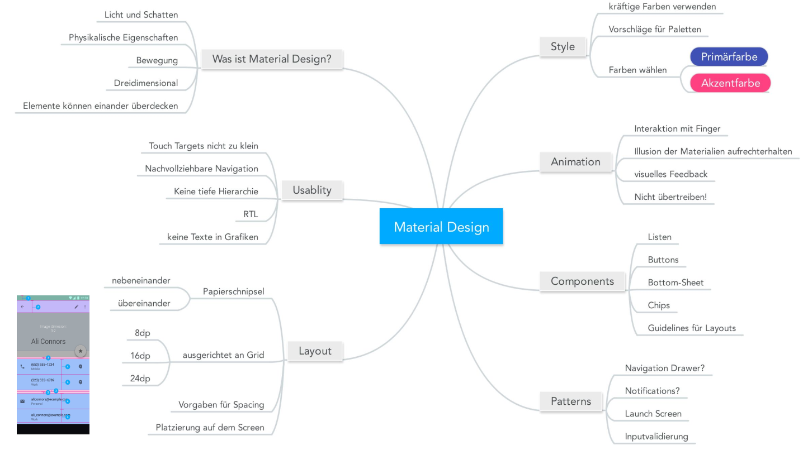
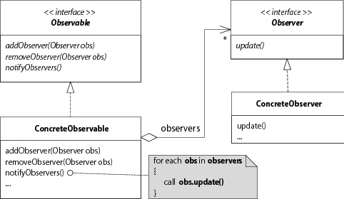

## Android Basics
### Android Basics
- Java 7 auf Android
- Activities sind ~"Screens"
- Apps werden automatisch geschlossen
- Allgemein wird der Lifecylce stark vom System gesteuert
- Eine Activity sollte eine einzelne Aufgabe realisieren
### Activity Lifecycle
- Activity kann sich in verschiedenen Zuständen befinden: Wird gestartet, ist aktiv, wird in den Hintergrund gehen, etc.
- Die einzelnen Methoden werden überschrieben (z.B. `onCreate()`)
- Start einer Activity: `onCreate()`, `onStart()`, `onResume()`, erst dann ist sie interagierbar
- Wird eine Activity überdeckt, wird sie pausiert `onPause()`. Kommt sie wieder in den Vordergrund, wird nur `onResume()` aufgerufen
- `onDestroy()` könnte auch direkt anderen Zuständen aufgerufen werden!
- Bei Konfigurationsänderungen wird die Activity neu gestartet (zerstört und neu aufgebaut). Also auch z.B. beim Drehen des Screens!
- Daten in `onPause()` sichern, da `onStop()` und `onDestroy()` nicht zwingend aufgerufen werden
- Activities werden in einem Stack verwaltet (muss nicht von gleicher App sein)
- Der Back-Button poped normalerweise die oberste Activity auf dem Stack
- Eine Gruppe von Activities (= Activity Stack) heissen "Task"
- Eine geöffnete App ist ein Task, bzw. ist ein Eintrag im "Overview Screen" ein Task
-  Mit Launch-Modes kann das Verhalten von Tasks verändert werden


### Systemsicht
- Pro APK wird ein Prozess mit einem Thread gestartet
- Jede APK wird unter eigenem Linux User installiert
- APKs sind quasi JARs (= Zip-Files) 
### Intents
- Alle Intents werden über das System verwaltet
- Expliziter Intent: Eine bestimmte Klasse ansprechen
- Impliziter Intent: z.B. "Absicht, Bild aufzunehmen"
- Explizite Intents normalerweise für interne Activities, implizite für generische Aktionen

---
## Grundlagen GUI
- Eine **View** ist immer eine Rechteckige Fläche, für die die View verantwortlich ist
- Widgets sind fertige Komponenten (buttons, images, checkboxes, ...)
- ViewGroup ist eine Unterklasse von View
- Layouts können ineinander verschachtelt werden (auch unterschiedliche)
- `match_parent`: Nimm den ganzen Platz ein
- `wrap_content`: Nur so viel Platz wie nötig
- Linear-Layout: Wenn kein Gewicht angegeben wird, wird möglichst wenig Platz verwendet. Mit Gewicht entsprechend dem Werten (mehr Gewicht -> mehr Platz)
- Neu gibt es `ConstraintLayout`, das auf den GUI-Builder optimiert wurde. Ist allerdings noch in Alpha
- Die `R` Klasse enthält Konstanten für alle XML-Files im res-Ordner (wird vom Compiler generiert) und bildet dessen Ordnerstruktur ab
- `@+` ist die Definition einer Ressource, `@` ein Verweis darauf
- `mipmap`: Launcher-Icon der App
- Strings mit `getString(R.string.string_name)` abrufen
- `dimens.xml` enthält Dimensionen für Layouts, z.B. `16dp` und werden über einen Namen aufgerufen
- `dp`: Density-independent-pixels: Unabhängig von Screen-dpi. Der Basis-Faktor wird von 160dpi berechnet ("mdpi")
- Für verschiedene Screen-Grössen, Sprachen, Versionen, etc. werden verschiedene XML-Files angelegt

### Events
- Die App hat nach den Lifecycle-Aufrufen keine Kontrolle mehr. Das System sendet Events (ausgelöst durch User oder z.B. Sensoren), die dann behandelt werden (Event-Listener)
- Auch Widgets können Events auslösen (-> `TextWatcher`)
- Nur der Main-Thread darf das GUI verändern

```java
button.setOnClickListener(new View.OnClickListener() {
   @Override
   public void onClick(View v) {
      … 
   }
});
```

---
## Strukturierung und Navigation
### Navigations-Design
- Für einen ersten App-Entwurf ein Domain-Modell erstellen
- "Screen Map" - Beziehungen zwischen Screens erstellen
- Screens gruppieren, z.B. mehrere Screens mit Tabs (Panes) trennen
- Navigation: Parent-Child-Beziehung (Hierarchisch) oder "lateral Navigation" (zwischen zwei Kindern)
- Beispiel HSR-App: Home -> Cafeteria ist hierarchisch, einzelne Wochentage lateral
- Back-Button macht "zeitliche Navigation" (vorheriges Kind oder Parent)
- Button oben links sollte immer zum Parent zurück gehen
- Für eine Gesamtübersicht Wireframes / Storyboards erstellen

### Fragments
- Es kann nur immer eine Activity gleichzeitig aktiv sein.
- Fragment hat eigenen Lifecycle


- Ein Fragment kann in mehrere Activities eingebunden werden und eine Activity kann mehrere Fragments beinhalten
- Kann zur Laufzeit in Activity eingebunden (`onAttach()`) und wieder entfernt werden (`onDetach()`)

```java
public class MainFragment extends Fragment {

    OnItemSelected callback;
    
   @Override
   public View onCreateView(LayoutInflater inflater, 
     ViewGroup container, Bundle savedInstanceState) {
       return inflater.inflate(R.layout.fragment_main, container, false);
   }
   
   @Override
   public void onAttach(Context activity) {
       super.onAttach(activity);
       if (!activity instanceof OnItemSelected) {
           throw new AssertionError(
               "Activity must implement OnItemSelected!");
       }
       callback = (OnItemSelected) activity;
   }

}
```

- Fragments können fix eingebunden werden, direkt als `<fragment>` Tag im XML der Activity (mit `name` die Klasse angeben). Der Code der Activity ändert sich dabei nicht
```xml
<LinearLayout ...>
   <fragment
       android:id="@+id/fragment"
       android:name="com.example.myfragmentapplication.MainActivityFragment"
       android:layout_width="match_parent"
       android:layout_height="match_parent"
       tools:layout="@layout/fragment_main" />
</LinearLayout>
```
- Oder dynamisch: Normalerweise mit Frame-Layout
```xml
<LinearLayout ...>
   <FrameLayout
      android:id="@+id/fragment_container"
      android:layout_width="match_parent"
      android:layout_height="match_parent" />
</LinearLayout>
```
``` java
public class MainActivity extends Activity implements OnItemSelected {

   @Override
   protected void onCreate(Bundle savedInstanceState) {
       super.onCreate(savedInstanceState);
       setContentView(R.layout.activity_main);

       FragmentManager fragmentManager = getFragmentManager();
       FragmentTransaction fragmentTransaction = 
                               fragmentManager.beginTransaction();

       MainActivityFragment fragment = new MainActivityFragment();
       fragmentTransaction.add(R.id.fragment_container, fragment);
       fragmentTransaction.commit();
   }
   
   // Implement Callback method
}
```
- Im Unterschied zur Activity wird hier das Fragment selbst instanziert
- Fragment sollte unabhängig von der Activity sein
- Zur Kommunikation zwischen Fragment und Activity definiert das Fragment ein Interface, dass die Activity implementiert

### Master-Detail Navigation
- Ein Pattern, z.B. eine Liste mit Mails -> einzelne Mail
- z.B. hat das Phone-Design nur ein einzelnes Fragment pro Activity, das Tablet-layout zeigt beide Layouts auf der gleichen Activity an
- Wenn Activity einen Einstiegspunkt in die App sein kann, muss es eine Activity sein, kein Fragment

### Menüs
Programmatisch:
``` java
public boolean onCreateOptionsMenu(Menu menu) {
    menu.add(0, START_MENU_ITEM, 0, "Start");
    menu.add(0, SUBMIT_MENU_ITEM, 0, "Submit");
    return true;
}
public boolean onOptionsItemSelected(MenuItem item) {
    switch (item.getItemId()) {
        case START_MENU_ITEM:
            // handle start
            return true;
        case SUBMIT_MENU_ITEM:
            // handle submit
            return true;
    }
    return super.onOptionsItemSelected(item);
}
```
- Deklarativ: als menu-File in XML (besser)
```xml
<menu xmlns:android="http://schemas.android.com/apk/res/android"
   xmlns:tools="http://schemas.android.com/tools" tools:context=".MainActivity">

   <item android:id="@+id/action_search" 
       android:title="@string/action_search"
       android:icon="@drawable/ic_action_search"
       android:orderInCategory="100"
       android:showAsAction="never" />

   <item android:id="@+id/action_settings"    
       android:title="@string/action_settings"
       android:orderInCategory="100"
       android:showAsAction="never" />
</menu>

```

- Einbinden mit `getMenuInflater().inflate(id, Menu)` in der `onCreateOptionsMenu()` Methode
- Mit dem "PreferenceScreen" kann ein Settings-Menü gebaut werden
- Auch das Fragment kann ein Menü steuern
- Nach Android 5.0 ist die "ActionBar" deprecated, neu ist die "Toolbar"
- Navigation Drawer ("Hamburger Menu") hat schlechte usability

---
## Listen und Persistenz
### Listen
- ListView
```xml
<ListView
   android:layout_width="match_parent"
   android:layout_height="match_parent"
   android:id="@+id/listView"/>
```
- Die ListView nutzt einen Adapter über ein Interface, der die Klassen an das Interface anpasst
- Adapter muss wissen, wieviele Elemente es gibt (`getCount()`) und ein bestimmtes Element zurückgeben (`getView()`)
- Layout der jeweiligen Einträge sind in eigenem Layout definiert
- `getView()` in eigenem Adapter überschreiben
```java
public View getView(int position, View convertView, ViewGroup parent) {
   final Module module = modulList.get(position);

   if (convertView == null) {
       LayoutInflater layoutInflater =
            (...) getSystemService(Context.LAYOUT_INFLATER_SERVICE);
       convertView = layoutInflater.inflate(R.layout.rowlayout, null);
   }
   // Get views with findViewByID, display data and set listeners
   return convertView;
}
```
- An einer View kann ein Tag angehängt werden (beliebiges `Object`)
- Für Performance-Optimierung: `findViewByID()` nur beim ersten Mal aufrufen und im Tag speichern

```java
if (convertView == null) {
   ...

   TextView textView = (TextView) convertView.findViewById(R.id.textView);
   CheckBox checkBox = (CheckBox) convertView.findViewById(R.id.checkBox);

   Pair<TextView, CheckBox> views = new Pair<>(textView, checkBox);
   convertView.setTag(views);
}

Pair<TextView, CheckBox> views = (Pair<TextView, CheckBox>) convertView.getTag();
TextView textView = views.first;
CheckBox checkBox = views.second;
```

### Recycler View
- In `RecyclerView` ist die Optimierung bereits eingebaut
    - In `onBindViewHolder()` sind die UI-Elemente schon drin im ViewHolder und müssen nur noch abgefüllt werden
    - Variante mit ListView quasi aufgeteilt in zwei Methoden

```java
public class MyAdapter extends RecyclerView.Adapter<ViewHolder> {
    private ArrayList<Module> dataset;

    public MyAdapter(ArrayList<Module> modules) {
        dataset = modules;
    }

    @Override
    public ViewHolder onCreateViewHolder(ViewGroup parent, int viewType) {
        LayoutInflater layoutInflater = LayoutInflater.from(parent.getContext());
        View v = layoutInflater.inflate(R.layout.rowlayout, parent, false);
        TextView textView = (TextView) v.findViewById(R.id.textView);
        CheckBox checkBox = (CheckBox) v.findViewById(R.id.checkBox);
        ViewHolder viewHolder = new ViewHolder(v, textView, checkBox);
        return viewHolder;
    }

    @Override
    public void onBindViewHolder(ViewHolder holder, int position) {
        final Module module = dataset.get(position);
        holder.textView.setText(" (" + module.getCode() + ")");
        holder.checkBox.setText(module.getName());
        holder.checkBox.setChecked(module.isSelected());
    }

    @Override
    public int getItemCount() {
        return dataset.size();
    }
}
```
```java
public class ViewHolder extends RecyclerView.ViewHolder {
    public View parent;
    public TextView textView;
    public CheckBox checkBox;

    public ViewHolder(View parent, TextView textView, CheckBox checkBox) {
        super(parent);
        this.parent = parent;
        this.textView = textView;
        this.checkBox = checkBox;
    }
}
```

---
## Persistenz
- `onSaveInstanceState()` speichert per default alle Views mit einer ID im Bundle gespeichert
    - Wird aber nicht immer ausgeführt (z.B. über Back-Button verlassen)
- `onCreate()` erhält das Bundle von `onSaveInstanceState()`
- `super.onCreate(savedInstanceState)` speichert alle Views, die eine ID haben
- Konsequenz: Daten immer in `onPause()` sichern
- Shared Preferences (nur bool, float, int, long, String, Set<String>)

```java
SharedPreferences settings = getSharedPreferences(PREFS_NAME, MODE_PRIVATE);
SharedPreferences.Editor editor = settings.edit();
editor.putBoolean("disabled", false);

boolean isDisabled = settings.getBoolean("disabled", false);

editor.commit();
```
- Andere Möglichkeiten: Auf Filesystem oder SQLite sichern
- SQLite Helper trackt die Version. Wenn z.B. das Schema geändert wird, kann bei einem Update der App eine neue Version angegeben werden, um die Daten zu migrieren (in `onUpgrade`)

### Hintergrundaktionen
- Mit `Runnable` die Methode `run()` überschreiben
- Einen neuen Threat starten

```java
public void onClick(View v) {

   Runnable runnable = new Runnable() {
       @Override
       public void run() {
           final Bitmap bitmap = download("http://slow.hsr.ch/hsr_cat.bmp");

           Runnable command = new Runnable() {
               @Override
               public void run() {
                   imageView.setImageBitmap(bitmap);
               }
           };
           imageView.post(command); // command wird im GUI-Thread ausgeführt
       }
   };
   Thread thread = new Thread(runnable);
   thread.start();
}
```
- Views dürfen nur aus dem Main-Thread verändert werden, darum `imageView.post()`. Dies setzt einen neuen Task in die Event-Queue
- OK für einfache Tasks, besser mit AsyncTask
    - `onPreExecute()`: Vorbereitung im UI-Thread
    - `doInBackground()`: In eigemen Thread ausgeführt
    - `onPostExecute()`: Resultat setzen, wieder im GUI-Thread

```java
class DownloadBitmapTask extends AsyncTask<String, Void, Bitmap> {

   @Override
   protected void onPreExecute() {
       super.onPreExecute();
   }

   @Override
   protected Bitmap doInBackground(String... params) {
       return download(params[0]);
   }

   @Override
   protected void onPostExecute(Bitmap bitmap) {
       imageView.setImageBitmap(bitmap);
   }
}

new DownloadBitmapTask().execute("http://slow.hsr.ch/hsr_cat.bmp");
```

---
## Material Design



---
## Vorlesung 6 - Patterns & Serivces
### UI Patterns
- Multitier Architecture
    - Aufteilung in (typisch) 3 Layer: Presentation, Domain, Data
    - Presentation ist verantwortlich für die Darstellung, hat auf Domain Zugriff
    - Domain enthält Business Logik und Domain Klassen
    - Data implementiert die Speicherung der Daten und stellt sie der Domain zur Verfügung
- Keine Zyklen erlaubt
    - Observer-Pattern verwenden



- Android basiert lose auf MVC, die View ist aber nicht sauber vom Controller gekapselt (Activity)
### Services
- Muss im Manifest deklariert werden
```xml
<application>
   <service 
       android:name=".ExampleService"
       android:exported="false" />
</application>
```


- Einmaliger Task -> started Service
    - Läuft im Hintergrund und wird nicht gestoppt, auch wenn die App pausiert / gestoppt wird
    - Läuft im gleichen Thread wie das UI!
    - Starten über einen Intent `startService(intent)`
    - `onStartCommand()` überschreiben, um Task auszuführen
    - mit `stopSelf()` im Service stoppen
    - IntentService kommuniziert über Intents, wird dann im `onHandleIntent()` abgearbeitet
    - Stellt einen Worker Thread zur Verfügung
    - Problem: Wie kann der Service die Activity benachrichtigen? -> Broadcasts oder "pending Intent"
- Client-Server-Kommunikation -> bound service
    - Auch über einen Intent gestartet
    - Gibt Interface, über den kommuniziert werden kann
- AsyncTask: Aufgabe von Main-Thread entkoppeln. Kombinieren mit Services, um GUI-Thread nicht zu blockieren
- Beide Möglichkeiten brauchen dieselbe Service-Klasse

### Broadcast Receiver
- Das System versendet Meldungen als Intents
- z.B low battery, Power connected, boot completed, etc.
- Registrierung
    - Statisch im Manifest mit einem intent-Filter
    - Dynamisch über einen `LocalBroadcastManager`
- Eigene Broadcasts versenden mit `sendBroadcast(intent)`
- Es können auch Broadcasts innerhalb der App versendet werden
- Receiver können statisch oder dynamisch registriert werden:
```java
LocalBroadcastManager lbm = 
    LocalBroadcastManager.getInstance(getApplicationContext());
IntentFilter filter = new IntentFilter(Intent.ACTION_BOOT_COMPLETED);
MyBroadcastReceiver receiver = new MyBroadcastReceiver(this);
lbm.registerReceiver(receiver, filter);
```
```java
private class MyBroadcastReceiver extends BroadcastReceiver {
   public MyBroadcastReceiver(MainActivity activity) {
   }

   @Override
   public void onReceive(Context context, Intent intent) {
   }
}
```

---
## Weiterführende Themen
### Sensoren
- Unterstützung von Gerät zu Gerät verschieden
- Qualität der Daten sehr unterschiedlich
- Sensordaten unterschiedlich zu interpretieren
- Delay gibt an, wie häufig Daten abgefragt werden (braucht entsprechend mehr oder weniger Strom)

```java
sensorManager = (SensorManager) getSystemService(Context.SENSOR_SERVICE);
lightSensor = 
    sensorManager.getSensorList(Sensor.TYPE_LIGHT).get(0); 
    // Prüfen, ob Sensor existiert!
...
// onResume():
sensorManager.registerListener(this, lightSensor, 
    SensorManager.SENSOR_DELAY_NORMAL);
// Im onPause listener wieder abmelden
...
@Override
public void onSensorChanged(SensorEvent event) {
    textView.setText(String.format("Helligkeit: %.0f", event.values[0]));
}
```
### Dependency Injection
- Problem: Klasse ist von einer anderen direkt abhängig und instanziert diese (z.B. wird eine Server-Adresse gesetzt)
- Schlecht testbar mit einem Fake-Server
- Lösungsansatz: Klasse braucht ein Interface, dass dann z.B. von einem richtigen Service und einem "Fake"-Service implementiert wird
- Implementation
    - Instanzierung im Konstruktor
    - Builder-Pattern (z.B. wie AlertDialog)
    - Dagger 2 Framework
- Bringt zentrale Konfiguration und einfachere Testbarkeit, aber ist mehr Schreibaufwand
- View Injection
    - Mit 3rd-Party-Library "Butterknife"
    - Macht binds anhand von annotierten attributen und methoden

### Data Binding
- Idee: im XML direkt auf Objekte zugreifen, damit es sich von selbst aktualisiert ("XML ist der Observer")
- `layout`-Tag als Root-Element, spezifisches Layout darin verschachtelt
- Im layout gibt es einen `<data>` Block mit Variablen-Namen und Typen
- Zugriff im Layout mit `@(<expression>)`
- Es wird eine Klasse generiert, z.B. `ActivityMainBinding`, über den das Data-Binding gemacht werden kann
- Klasse bietet Setter-Methoden für die Variablen
- Auch Listener können direkt im layout gebindet werden
- Um Views automatisch zu aktualisieren, `ObservableField<T>` verwenden
- Aufpassen, dass nicht zuviel Logik ins XML kommt
