# Software Engineering 1
## Allgemein
- Prüfung closed book
- Abgabe von 3 von 4 Testat-Übungen
- Selbststudium: Jede Woche in Buch lesen, nach Lektionsplan sheet

## Vorlesung 1
- Ca. 70% aller IT-Projekte laufen schief
- Erwartungskonflikt Kunde - Programmierer, ...
- OOA nach Larman: Statisches Domain Model ohne Funktionen, Black-Box Sequenzdiagramm
- "Klassisch": Statisches Model mit Funktionen, White-Box Sequzendiagramms

---
## Vorlesung 2 - Domain-Modellierung
- Design-Modell zeigt eine Realisation, ein Domain-Modell auch Dinge, die nicht realisiert werden (Domain-Modell ist Inspiration für Design-Modell)
- Entitäten (Konzepte) finden: 
    - Keine Implementations-Konzepte verwenen (z.B. "Datenbank", "Webserver", etc.)
    - Keine abgeleiteten Konzepte (Dinge, die durch andere Dinge berechnet werden kann, z.B. ein Logfile)
- Semantic Gap: Unterschied zwischen realer Welt bzw. Domain Model und Design Model bzw. Code. Diese Gap ist bei OO-Design sehr klein, z.B. bei Assembler sehr gross
- n-m-Assoziationen sind im Domain Modell erlaubt, aber oft nich richtig, da die Assoziation eigene Attribute hat
- Sobald ein Attribut eine gewisse Komplexität hat, in eigenes Konzept auslagern (im Zweifelsfall Konzept!)
- Abstrakte Superclasses werden *kursiv* geschrieben (= Es gibt keine Instanzen der abstrakten Klasse)

---
## Vorlesung 4 - Requirements
### Einführung
- Requirements Modulanmeldung HSR
    - Funktional
        - Temporale und personelle Zugangsbeschränkungen
        - Alle Module müssen abgebildet sein
        - Benutzer muss sich für Module an- und abmelden können
        - Übersichtliche Strukturierung
        - Eigene Daten und Daten anderer Studenten können eingesehen werden
        - Voraussetzungen für Module prüfen
    - Nicht-Funktional (Qualität / Wie gut?)
        - System muss sicher sein
        - Antwortzeit 500ms
        - Umgebung / Programmiersprache
    - Prozess-Anforderungen
        - Kostenschätzung
- Probleme: Ablauf? Machbarkeit? Prioritäten?
- Anforderungen aus *Sicht der Benutzer* erstellen
- 30% aller Probleme in SE sind wegen Requirement Specification
- Umfassendes SRS am Anfang ist problematisch!
- Anforderungen ändern sich, daher iterativ vorgehen -> Requirements Management

### Use-Cases
- Use-Case ist *textuelle* Beschreibung "Actor tut das, dann macht das System ..."
- Geschichte aus Benutzersicht
- Aktor kann auch externes System sein (als Box dargestellt)

---
## Vorlesung 5 - NF, SRS, Modelling Behaviour
- Nichtfunktionale Anforderungen sind Qualitätmerkmale, Randbedingungen, Leistung, Mengen, ...
- Geht oft vergessen, weil die Anforderung aus Kundensicht angesehen werden muss
- Sind oft auch implizit / unbewusst
- "Other Requirements" können solche sein, die in vielen UCs vorkommen bzw. sehr allgemein sind

### Modelling Behaviour
- Sind formale Beschreibungen (können auch maschineninterpretiert werden)
#### Zustandsdiagramme
- Kreis zeigt Initial State
- Boxen sind Zustände
    - Name ist Adjektiv
    - Kann entry und exit-Acitivites haben
    - do-Acitivty läuft, solange System im Zustand ist
    - Kann auch interne Events / Übergänge haben (wiee ein Loop zu sich selbst)
- Übergänge mit angeschriebenen Pfeilen ("Events")
    - `event [guard] / activity`
    - `guard` ist Bedingung (precondition)
    - `activity` wird ausgeführt
    - Werden "augenblicklich" ausgeführt
- Endzustand eingerahmter Kreis (à la DEA)
- Zustände können verschachtelt werden, dass ein einzelner Zustand wieder ein kompletter Ablauf darstellt
- In einem nested State kann von jedem Zustand aus der nested State verlassen werden (in Folie 15 kann aus jedem Zustand "on hook" ausgelöst werden)

---
## Vorlesung 6
- Erweitertes Zustandsdiagramm: Man kann Variablen verwenden und als Aktivität diese verändern, z.B. erhöhen
- Mit Guards können Variablenwerte geforder werden, z.B. `[count == 10]`

### Aktivitätsdiagramme
- Join wartet auf beide Inputs (synchronisiert), Merge hingegen nicht, es werden nur zwei Pfade zusammen ge"merged"
- "Partitions" unterteilen Teile des Prozesses in verschiedene Abteilungen

### Software Testing
- Testspezifikation bei Unit-Tests: Der Code. Testprotokoll: Ergebnis der Tests
- Gesamtsystemtest
    - Spezifikation: Anforderungen des Systems mit einem konkreten Szenario (meist aus Sicht der Benutzer)
    - Protokoll: Sind Anforderungen erfüllt? z.B. Checkliste
- Unittests sollte immer reproduzierbar und nachvollziehbar sein
- Gesamtsystemtests: Nicht immer reproduzierbar, da von einer Person durchgeführt
- Anforderungskategorien auf Testkategorien abbilden. Deshalb: Anforderungen müssen testbar sein!
- Verifikation: Erfüllen die Work Products die Vorgaben? (untere Ebenen)
- Validierung: Entwickle ich das richtige Produkt? (Nach Kundenbedürfnissen) (obere Ebenen)
- Auf niedrigsten Ebenen (Implementation) werden tendenziell White-Box-Tests gemacht. Auf höheren Ebenen eher Black-Box-Tests (vor allem für den Abnahmetest)

---
## Woche 7 - eLearning Microtests

- Error vs. Failure
    - Error: The code *terminates prematurely* (unhandled exception)
    - Failure: Some actual value doesn't match the expected value

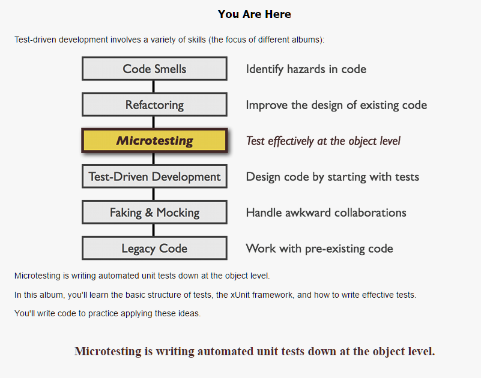
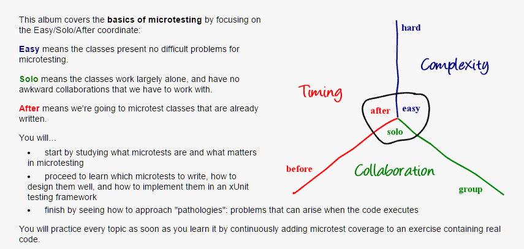
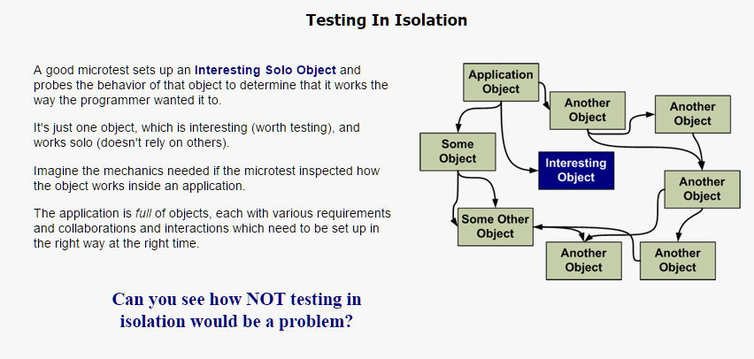
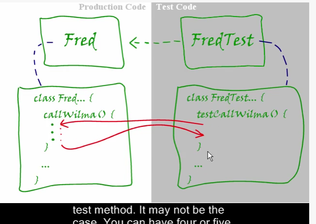
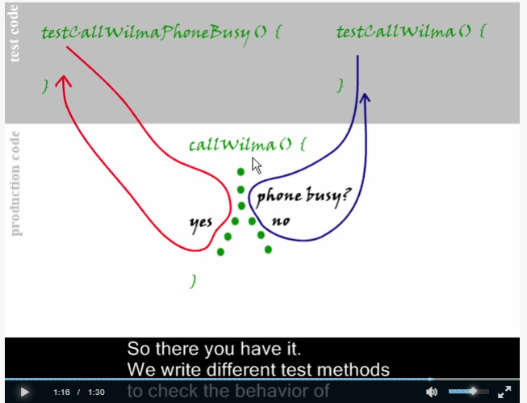
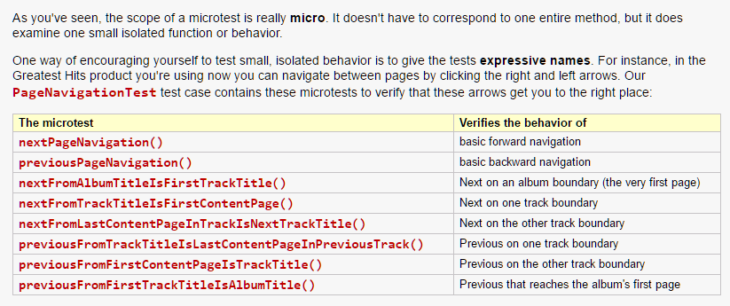

"Micro Tests" are unit tests, but short, cheap and plentiful

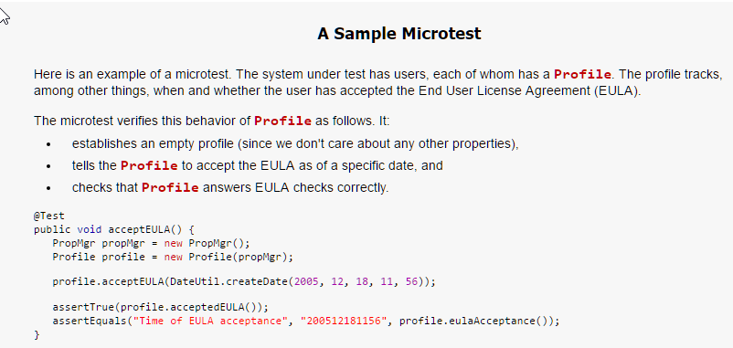
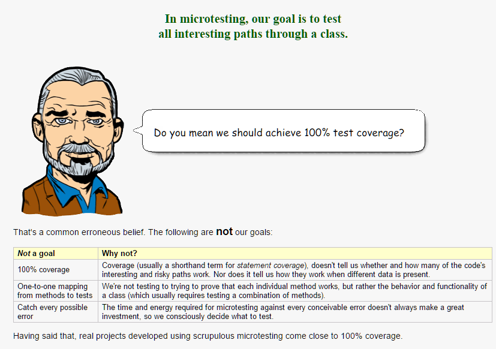
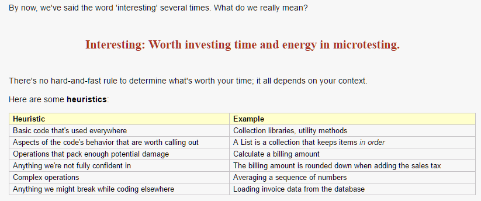
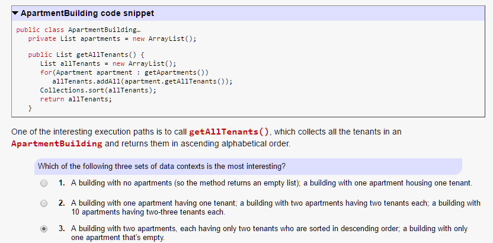
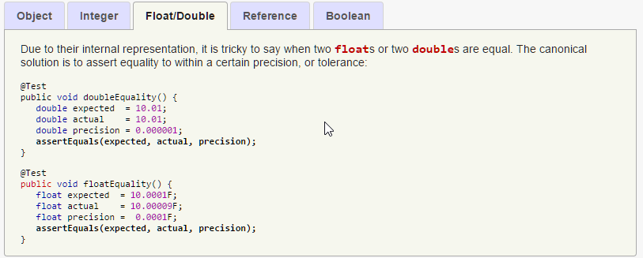
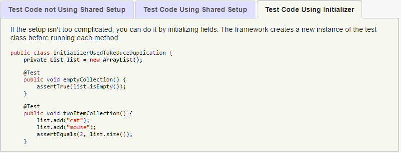
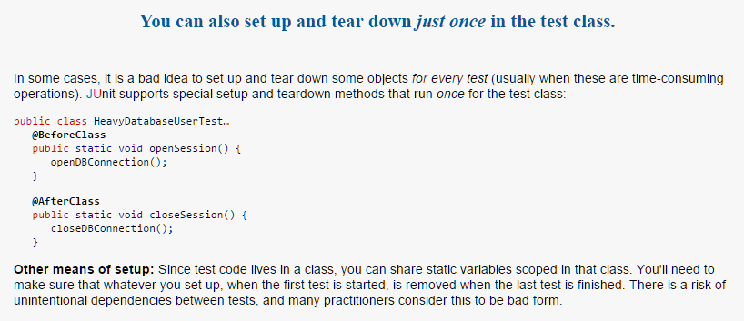

- Strucute AAA (+ Teardown)
    - Arrange: Instantiate, get to the execution path
    - Act: Invoke Methods unter test
    - Assert: Assert Test conditions
    - (Teardown)
- Test organization
    - Tests in the **same namespace**, but different folder on the disk, than the tested class

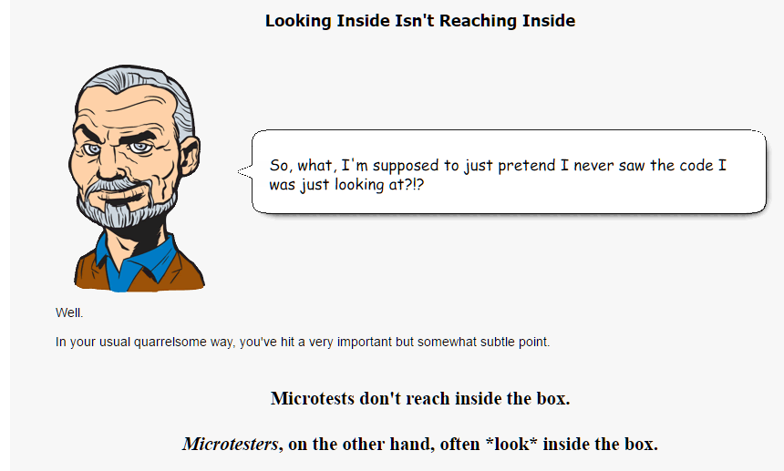
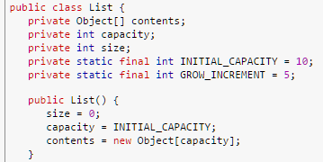
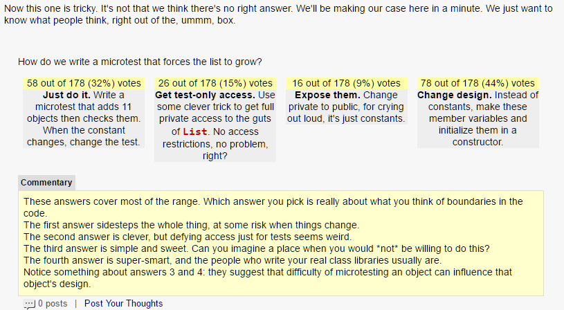
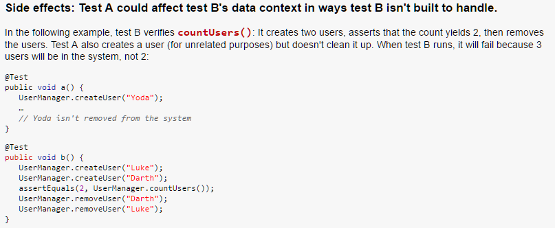
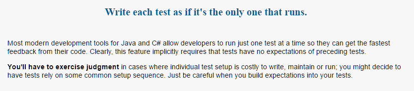
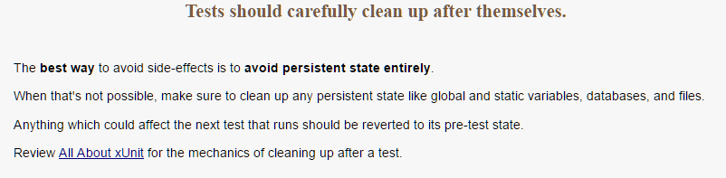
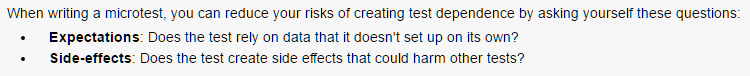
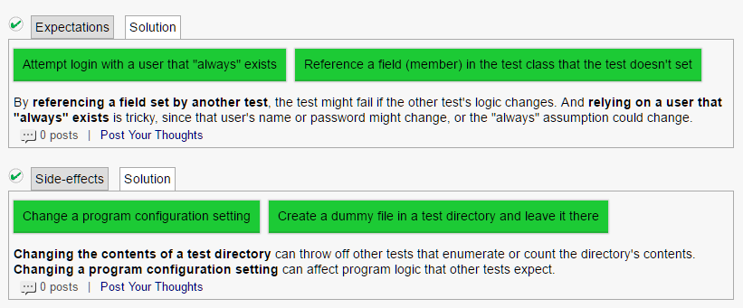

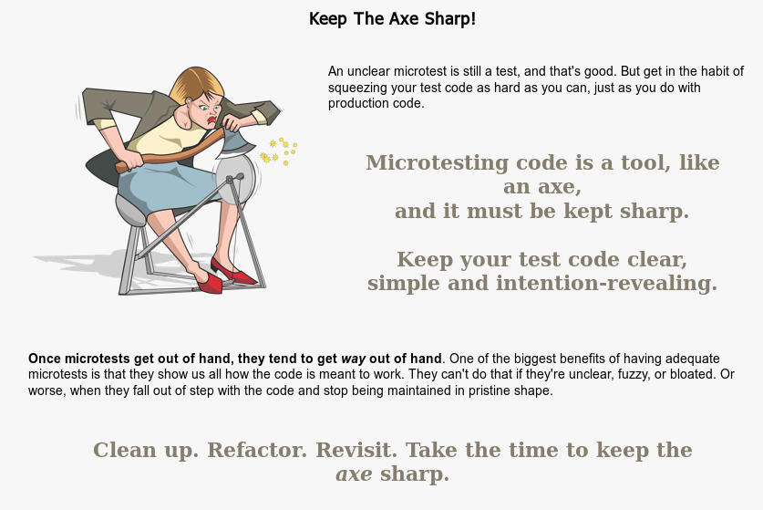
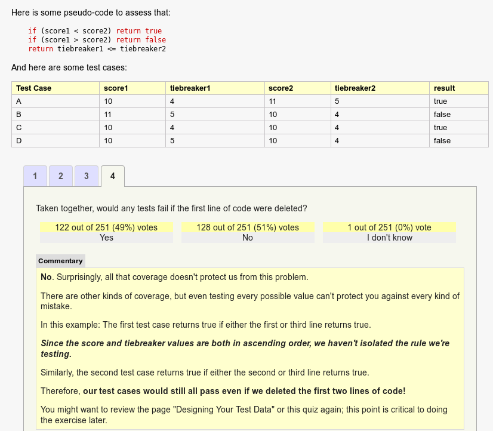

---
## Vorlesung 9 - Design Patterns
- Folie 12: Dies ist das **Strategy Pattern**
    - Jede Duck muss eine Strategie implementieren (Flug und Quacken)
    - Vorteil: Man kann z.B. über eine Liste von Ducks iterieren und auf allen `fly()` aufrufen. Geht z.B. nicht, wenn man Interface `flyable` machen würde
- Decorator-Pattern
    - Klassen ineinander verpacken
    - Kosten werden von Aussen nach Innen addiert
    - Decorator erbt von Component, aber hat selbst eine Referenz auf eine Component
- Composite
    - Jede Composite hat eine oder mehrere Components als Childdren, diese kann jeweils ein Leaf, oder wieder ein Composite sein
    - Problem: Ein Composite hat keine eigene Operation, es werden nur Operationen auf Leafs ausgeführt
- Factory
    - Instanziierung mit komplexer Logik in sepparate Klasse auslagern

### Übung 09
- *TODO* BILDER EINFÜGEN
- Strategy Pattern: In Wikipedia ist die Strategie-Klasse ein Interface, im Quiz eine konkrete Klasse
    - Konkrete Klasse für default implementation. Bei Interface nicht möglich
- Observer Pattern: Im GOF gibt es ein konkretes Subject, bei Wikipedia nicht. Das concrete Subject ist nötig, da es das effektive Objekt ist, das "observed" wird
- MVC geht auch ohne Observer-Pattern: Der Controller kennt das Model und die View. Wenn das Model sich ändert, weiss das der Controller und meldet dies der View. Mit dem Observer Pattern werden die Views über den Observer vom Model benachrichtigt, der Controller muss die View nicht mehr kennen
    - MVC ohne Observer nur mit 1 View oder wenn die Daten "unter" dem Modell nicht verändert werden

---
## Vorlesung 10 - SW-Architektur (1)

- Diagramm mit Packages so detailiert, damit man es noch gut kommunizieren kann
- Gute Kohäsion von Klassen entsteht oft durch Single Responsibility
- Tiefe Kopplung: Möglichst wenig Abhängigkeiten von anderen Klassen
- In den Schichten geht Abhängigkeit immer von oben nach unten
- Je weiter hoch in den Schichten, desto schwieriger werden Unit-Tests
- Vererbung kann hohe Kopplung ergeben
- Partitionen: Vertikale Unterteilungen in der gleichen Schicht
    - Wieder möglichst wenige Abhängigkeiten zwischen den Partitionen
- Layers vs. Tiers
    - Layers sind Schichten, wie der Code hierarchisch getrennt ist
    - Tiers sind die Abgrenzungen von Laufzeitumgebungen (z.B. unterschiedliche Server)
    - i.d.R. sind Aufrufe sind Aufrufe zwischen Layer synchron, zwischen Tiers immer asynchron

## Vorlesung 11 - Unified Process / Sequenzdiagramme
### Unified Process

### Sequenzdiagramme
- Kann nützlich sein, Prozesse abstrakt zu beschreiben
- Wenn es zu detailiert ist, ist es sehr nah am Code
    - Das gibt Abhängigkeiten untereinander -> problematisch

---
## Vorlesung 12 - Scrum
- Backlog: Stapel mit kleinen Arbeitspaketen
- Alle Arbeitspakete sind User Stories
- User Story: Wer möchte was erreichen (Ziel) weil ... (Grund)
- Sprints: Iterationen von 2-3 Wochen, immer die gleiche Länge
    - Fest Timeboxed, egal ob fertig oder nicht
- Product Owner: Ist verantwortlich, dass Produkt richtig realisiert wird (normaleweise von der Firma, die den Auftrag gegeben hat)
- Team Speed: Anzahl Arbeitstage pro Sprint (über alle Mitglieder). Reserve einplanen und nach jedem Sprint anpassen
- Bugs kommen auch in den Product Backlog
- Grundregel: *Entwickler schätzen, Kunde priorisiert*

1. Product Owner erstellt User Stories
2. Mit Entwickler-Team besprechen, bis alle alles verstehen
3. Entwickler-Team teilt "Kosten" zu (Zeitaufwand)
4. Für den ersten Sprint die ersten Stories auswählen (in den Sprint Backlog), entsprechend des Team Speeds
5. Am Schluss des Sprints nimmt Product Owner die erledigten Stories ab. Nicht erledigte / abgenommene zurück in den Product Backlog

---
## Vorlesung 13 - SW-Architektur 2
- Architektur wird stark beeinflusst, ob Applikation Zugriff auf Server macht, Online / Offline-Mischung, Web-Only ist, etc.
- Vier von Sechs Faktoren, die die Architektur beeinflussen, sind nicht-funktionale Anforderungen!
- UML-Diagramme, die 1:1 Code sind, nützen nichts, da sie keine Abstraktion sind
    - Sie können aber Zusammenhänge anschaulich darstellen (Domainmodell, Sequenzdiagramm)

---
## Vorlesung 14 - Software Projekt-Management
1. **Nichts vergessen dank Listen**
    - Backlog führen
    - PL hat ToDo-Liste
    - Prioritäten in ca. 3 Stufen
2. **PL is the keeper of the Scope**
    - Immer den Funktionsumfang im Zaum halten
    - Budget nicht mit Scope verwechseln!
    - Use Cases schreiben, auch für Dinge, die nicht umgesetzt werden
    - "Scope creep": schleichende Erweiterung des Scopes
        - 2% pro Monat sind normal
        - Faustregel: Kein Projekt über 9 Monate
3. **Gehen Sie jeden Tag auf die Baustelle**
    - PL sollte täglich "auf die Baustelle"
    - Baustelle = Git
4. **Entfernung ist teuer**
    - Team möglichst am selben Ort ("im selben Stockwerk")
    - Je höher die Distanz, desto teurer
    - Unterschiedliche Muttersprache auch ein Faktor
5. **Übergaben sind teuer**
    - Möglichst guter und präziser Informationsaustausch
6. **Kunst: Sichtbar machen**
    - Software für nicht-Programmierer sichtbar machen
    - Ideen / Konzepte erklären mit Metaphern, Analogien, Diagramme
7. **Immmer iterativ vorgehen**
    - Agile (Scrum, etc)
    - Sprints 2-3 Wochen, Kunden-Demos alle 2-3 Monate
8. **Inspect - Adapt**
    - Ständig auf veränderte Umstände reagieren
    - immer Acht geben und ggf. reagieren
    - Management by walking around
    - Reviews machen
    - Projekt-Geschichtsschreibung
        - Regelmässig aufschreiben
        - Meilensteine, Schwierigkeiten, besondere Vorfälle, Protokolle
        - Protokolliert Erfahrungsschat
9. **Daily Build and Branches**
    - Nicht zu viele Branches, schwieriger zu sehen, wie weit man ist
    - Möglichst schnell in den Master-branch mergen
    - Regelmässige Releases
10. **Verstehen, was der Kunde will**
    - Optimal: Kunde im Team
    - Gut: Kunden-Proxy im Team
    - Schlecht: Kunde hat keine Zeit
    - Möglichst den Endkunden fragen, nicht z.B. der CEO
    - Partner sein, Vertrauen schaffen
    - Wenn Entwickler und Kunden sich verstehen -> Meilenstein
11. **So früh wie möglich so formal wie möglich**
    - z.B. UML zeigen Unklarheiten auf
    - Möglichst sichtbar machen: Bilder und Grafiken für Konzepte
12. **Die vier Projekt-Variablen**
    - Kosten/Aufwand
    - Zeit
    - Funktionalität
    - Qualität
    - Reihenfolge einfach -> schwierig
    - Wenn überbestimmt:
        - Priorisierung
        - Funktionalität reduzieren (Reduce the Scope)
        - Wenn das nicht geht: Zeitplan verlängern
