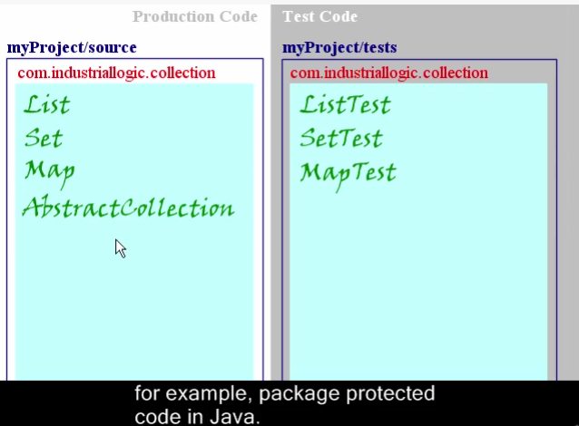

# Software Engineering 1
## Allgemein
- Prüfung closed book
- Abgabe von 3 von 4 Testat-Übungen
- Selbststudium: Jede Woche in Buch lesen, nach Lektionsplan sheet

## Vorlesung 1
- Ca. 70% aller IT-Projekte laufen schief
- Erwartungskonflikt Kunde - Programmierer, ...
- OOA nach Larman: Statisches Domain Model ohne Funktionen, Black-Box Sequenzdiagramm
- "Klassisch": Statisches Model mit Funktionen, White-Box Sequzendiagramms

---
## Vorlesung 2 - Domain-Modellierung
- Design-Modell zeigt eine Realisation, ein Domain-Modell auch Dinge, die nicht realisiert werden (Domain-Modell ist Inspiration für Design-Modell)
- Entitäten (Konzepte) finden: 
    - Keine Implementations-Konzepte verwenen (z.B. "Datenbank", "Webserver", etc.)
    - Keine abgeleiteten Konzepte (Dinge, die durch andere Dinge berechnet werden kann, z.B. ein Logfile)
- Semantic Gap: Unterschied zwischen realer Welt bzw. Domain Model und Design Model bzw. Code. Diese Gap ist bei OO-Design sehr klein, z.B. bei Assembler sehr gross
- n-m-Assoziationen sind im Domain Modell erlaubt, aber oft nich richtig, da die Assoziation eigene Attribute hat
- Sobald ein Attribut eine gewisse Komplexität hat, in eigenes Konzept auslagern (im Zweifelsfall Konzept!)
- Abstrakte Superclasses werden *kursiv* geschrieben (= Es gibt keine Instanzen der abstrakten Klasse)

---
## Vorlesung 4 - Requirements
### Einführung
- Requirements Modulanmeldung HSR
    - Funktional
        - Temporale und personelle Zugangsbeschränkungen
        - Alle Module müssen abgebildet sein
        - Benutzer muss sich für Module an- und abmelden können
        - Übersichtliche Strukturierung
        - Eigene Daten und Daten anderer Studenten können eingesehen werden
        - Voraussetzungen für Module prüfen
    - Nicht-Funktional (Qualität / Wie gut?)
        - System muss sicher sein
        - Antwortzeit 500ms
        - Umgebung / Programmiersprache
    - Prozess-Anforderungen
        - Kostenschätzung
- Probleme: Ablauf? Machbarkeit? Prioritäten?
- Anforderungen aus *Sicht der Benutzer* erstellen
- 30% aller Probleme in SE sind wegen Requirement Specification
- Umfassendes SRS am Anfang ist problematisch!
- Anforderungen ändern sich, daher iterativ vorgehen -> Requirements Management

### Use-Cases
- Use-Case ist *textuelle* Beschreibung "Actor tut das, dann macht das System ..."
- Geschichte aus Benutzersicht
- Aktor kann auch externes System sein (als Box dargestellt)

---
## Vorlesung 5 - NF, SRS, Modelling Behaviour
- Nichtfunktionale Anforderungen sind Qualitätmerkmale, Randbedingungen, Leistung, Mengen, ...
- Geht oft vergessen, weil die Anforderung aus Kundensicht angesehen werden muss
- Sind oft auch implizit / unbewusst
- "Other Requirements" können solche sein, die in vielen UCs vorkommen bzw. sehr allgemein sind

### Modelling Behaviour
- Sind formale Beschreibungen (können auch maschineninterpretiert werden)
#### Zustandsdiagramme
- Kreis zeigt Initial State
- Boxen sind Zustände
    - Name ist Adjektiv
    - Kann entry und exit-Acitivites haben
    - do-Acitivty läuft, solange System im Zustand ist
    - Kann auch interne Events / Übergänge haben (wiee ein Loop zu sich selbst)
- Übergänge mit angeschriebenen Pfeilen ("Events")
    - `event [guard] / activity`
    - `guard` ist Bedingung (precondition)
    - `activity` wird ausgeführt
    - Werden "augenblicklich" ausgeführt
- Endzustand eingerahmter Kreis (à la DEA)
- Zustände können verschachtelt werden, dass ein einzelner Zustand wieder ein kompletter Ablauf darstellt
- In einem nested State kann von jedem Zustand aus der nested State verlassen werden (in Folie 15 kann aus jedem Zustand "on hook" ausgelöst werden)

---
## Vorlesung 6
- Erweitertes Zustandsdiagramm: Man kann Variablen verwenden und als Aktivität diese verändern, z.B. erhöhen
- Mit Guards können Variablenwerte geforder werden, z.B. `[count == 10]`

### Aktivitätsdiagramme
- Join wartet auf beide Inputs (synchronisiert), Merge hingegen nicht, es werden nur zwei Pfade zusammen ge"merged"
- "Partitions" unterteilen Teile des Prozesses in verschiedene Abteilungen

### Software Testing
- Testspezifikation bei Unit-Tests: Der Code. Testprotokoll: Ergebnis der Tests
- Gesamtsystemtest
    - Spezifikation: Anforderungen des Systems mit einem konkreten Szenario (meist aus Sicht der Benutzer)
    - Protokoll: Sind Anforderungen erfüllt? z.B. Checkliste
- Unittests sollte immer reproduzierbar und nachvollziehbar sein
- Gesamtsystemtests: Nicht immer reproduzierbar, da von einer Person durchgeführt
- Anforderungskategorien auf Testkategorien abbilden. Deshalb: Anforderungen müssen testbar sein!
- Verifikation: Erfüllen die Work Products die Vorgaben? (untere Ebenen)
- Validierung: Entwickle ich das richtige Produkt? (Nach Kundenbedürfnissen) (obere Ebenen)
- Auf niedrigsten Ebenen (Implementation) werden tendenziell White-Box-Tests gemacht. Auf höheren Ebenen eher Black-Box-Tests (vor allem für den Abnahmetest)

---
## Woche 7 - eLearning Microtests

- Error vs. Failure
    - Error: The code *terminates prematurely* (unhandled exception)
    - Failure: Some actual value doesn't match the expected value

"Micro Tests" are unit tests, but short, cheap and plentiful

- Strucute AAA (+ Teardown)
    - Arrange: Instantiate, get to the execution path
    - Act: Invoke Methods unter test
    - Assert: Assert Test conditions
    - (Teardown)
- Test organization
    - Tests in the **same namespace**, but different folder on the disk, than the tested class

---
## Vorlesung 9 - Design Patterns
- Folie 12: Dies ist das **Strategy Pattern**
    - Jede Duck muss eine Strategie implementieren (Flug und Quacken)
    - Vorteil: Man kann z.B. über eine Liste von Ducks iterieren und auf allen `fly()` aufrufen. Geht z.B. nicht, wenn man Interface `flyable` machen würde
- Decorator-Pattern
    - Klassen ineinander verpacken
    - Kosten werden von Aussen nach Innen addiert
    - Decorator erbt von Component, aber hat selbst eine Referenz auf eine Component
- Composite
    - Jede Composite hat eine oder mehrere Components als Childdren, diese kann jeweils ein Leaf, oder wieder ein Composite sein
    - Problem: Ein Composite hat keine eigene Operation, es werden nur Operationen auf Leafs ausgeführt
- Factory
    - Instanziierung mit komplexer Logik in sepparate Klasse auslagern
